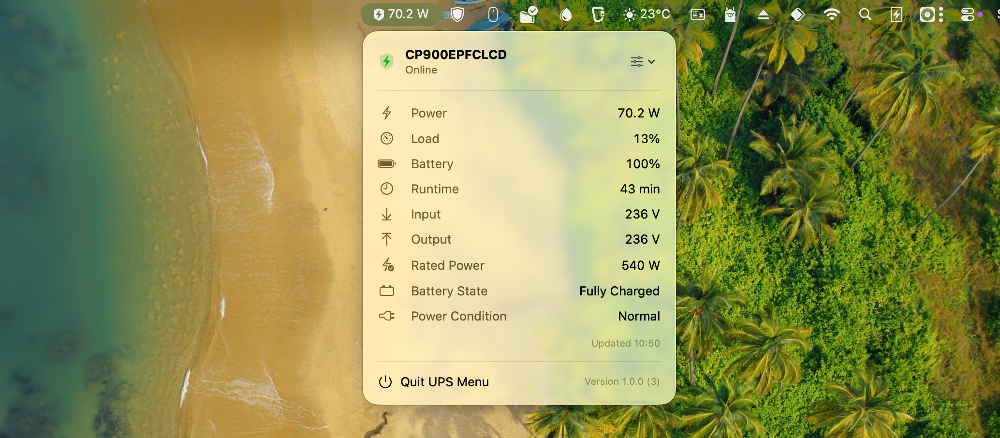

# UPS Menu



UPS Menu is a small native macOS menu-bar application that displays live data from a USB-connected UPS. It has no Dock icon or regular application windows. Click its menu-bar item to see the information popover, then use the sliders button to choose the rows shown and the single value displayed in the menu bar.

UPS Menu reads the device directly with Apple's shared `IOHIDManager` API. It does not install a privileged helper, claim exclusive USB access, connect to a cloud service, or collect analytics.

## Why UPS Menu?

- **Lightweight:** a focused native Swift application without a background service, web runtime, or vendor software suite.
- **Unobtrusive:** lives only in the menu bar, with no Dock icon or regular application windows.
- **Clean and configurable:** presents live UPS information in a compact macOS interface and lets you choose which metrics appear.
- **Private and local:** reads the UPS directly over USB without cloud accounts, analytics, or internet access.
- **Coexists with other software:** opens the HID device in shared mode instead of claiming exclusive USB access.

## Available Information

The application currently reads:

- estimated output power, calculated as rated power multiplied by reported load
- load percentage
- battery charge and estimated runtime
- input and output voltage
- rated active power and nominal input voltage
- low/high transfer-voltage thresholds
- battery state: charging, discharging, fully charged, or idle
- power conditions including low battery, overload, and automatic voltage boost

Instantaneous active power is not exposed by the tested UPS. The watt value is therefore an estimate: `rated watts x load percentage / 100`.

## Compatibility

Supported profiles are deliberately conservative. A UPS is listed as supported only after its report IDs, units, scaling, and behavior have been tested.

| Manufacturer | Model | USB ID | Status |
| --- | --- | --- | --- |
| CyberPower | CP900EPFCLCD | `0764:0501` | Supported and tested |

Many UPS products use the USB HID Power Device standard, but report IDs, optional fields, units, and vendor behavior differ. Sharing usage pages with a supported UPS does not make a device automatically compatible.

### Check Your UPS

Connect the UPS by USB and run:

```sh
./build.sh compatibility
```

The result is one of:

- `SUPPORTED`: a known profile matched and all required telemetry reports were read.
- `KNOWN DEVICE, BUT REQUIRED REPORTS ARE UNAVAILABLE`: the USB ID matched, but macOS could not read the expected report map.
- `CANDIDATE, NOT CURRENTLY SUPPORTED`: the device exposes equivalent standard HID usages, but requires a validated profile before the app can use it.
- `NOT COMPATIBLE WITH THE CURRENT READER`: one or more telemetry values required by the current UI are absent.

For a candidate or incompatible model, create a device-support issue and attach:

```sh
./build.sh compatibility --diagnostic
```

The diagnostic contains manufacturer, product, USB vendor/product IDs, HID report IDs, usages, units, and live UPS values. It intentionally does **not** read or print the USB serial number. Review output before posting it publicly.

Device mappings live in `UPSMenu/UPSDeviceProfile.swift`; adding an ID without validating its report map is not sufficient.

## Operation

The app opens the device in shared mode and reads HID Power Device usage pages `0x84` and `0x85`. This does not require a privileged helper or exclusive USB access.

Telemetry is refreshed every five seconds. Missing optional reports are omitted from the popover; missing core reports result in an unavailable state.

## Build

Requirements:

- macOS 14 or later
- Xcode 16.4 or later
- [XcodeGen](https://github.com/yonaskolb/XcodeGen), installable with `brew install xcodegen`

The build script regenerates the Xcode project before every operation:

```sh
./build.sh release
```

The application is created at `.release-build/Build/Products/Release/UPS Menu.app`.

Available modes:

```sh
./build.sh debug          # local Debug build
./build.sh release        # local Release build (default)
./build.sh test           # run the test suite
./build.sh distribution   # Developer ID signed Release build
./build.sh version        # show marketing version and build number
```

Local builds receive an ad-hoc signature so they can be launched immediately. Run `./build.sh` with no argument to use the default `release` mode.

### Versioning

The marketing version and build number are tracked in `VERSION` and `BUILD_NUMBER`. Every build mode embeds both values in the application bundle.

Increment the build number before producing another build:

```sh
./build.sh bump build     # 1.0.0 (1) -> 1.0.0 (2)
```

For a release-version change, bump the semantic component and the build number together:

```sh
./build.sh bump patch     # 1.0.0 (2) -> 1.0.1 (3)
./build.sh bump minor     # 1.0.1 (3) -> 1.1.0 (4)
./build.sh bump major     # 1.1.0 (4) -> 2.0.0 (5)
```

The bump command only updates the tracked files; run the desired build command afterward. Commit both files with the release sources so future builds continue from the correct values.

## Sign and Notarize for Distribution

The following workflow distributes the app directly outside the Mac App Store. Signing values are local configuration and must not be committed.

First confirm the certificate is available:

```sh
security find-identity -v -p codesigning
```

Create your ignored local signing configuration:

```sh
cp .signing.env.example .signing.env
```

Edit `.signing.env` with the team ID and exact identity shown by `security find-identity`, plus a bundle identifier that you control:

```sh
APPLE_ID="your-apple-account@example.com"
DEVELOPMENT_TEAM="ABCDE12345"
CODE_SIGN_IDENTITY="Developer ID Application: Your Name (ABCDE12345)"
BUNDLE_IDENTIFIER="com.example.UPSMenu"
```

Load the same values into the shell before running the later notarization commands:

```sh
source .signing.env
```

Build with the Developer ID Application identity and a secure timestamp:

```sh
./build.sh distribution
```

Alternatively, set `SIGNING_CONFIG` to another file path or export `DEVELOPMENT_TEAM`, `CODE_SIGN_IDENTITY`, and `BUNDLE_IDENTIFIER` in the shell. Distribution builds fail rather than falling back to a developer-specific identity or the local development bundle ID.

Verify the resulting signature:

```sh
codesign --verify --deep --strict --verbose=2 \
  ".distribution-build/Build/Products/Release/UPS Menu.app"
codesign -dv --verbose=4 \
  ".distribution-build/Build/Products/Release/UPS Menu.app"
```

Create a notarization credential once. Use an app-specific password generated at [account.apple.com](https://account.apple.com), not the normal Apple Account password:

```sh
xcrun notarytool store-credentials "UPSMenu-notary" \
  --apple-id "$APPLE_ID" \
  --team-id "$DEVELOPMENT_TEAM"
```

Package, submit, and staple the notarization ticket:

```sh
ditto -c -k --keepParent \
  ".distribution-build/Build/Products/Release/UPS Menu.app" \
  ".distribution-build/UPS Menu.zip"

xcrun notarytool submit ".distribution-build/UPS Menu.zip" \
  --keychain-profile "UPSMenu-notary" \
  --wait

xcrun stapler staple \
  ".distribution-build/Build/Products/Release/UPS Menu.app"
xcrun stapler validate \
  ".distribution-build/Build/Products/Release/UPS Menu.app"
spctl --assess --type execute --verbose=4 \
  ".distribution-build/Build/Products/Release/UPS Menu.app"
```

After stapling, recreate the ZIP from the stapled application before publishing it. Notarization requires an active Apple Developer Program membership, a valid Developer ID Application certificate, and network access to Apple's notarization service.

## Contributing and Security

See [CONTRIBUTING.md](CONTRIBUTING.md) for development and device-profile requirements. Report vulnerabilities according to [SECURITY.md](SECURITY.md). This project is available under the [MIT License](LICENSE).